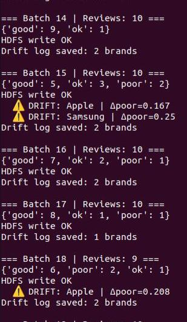
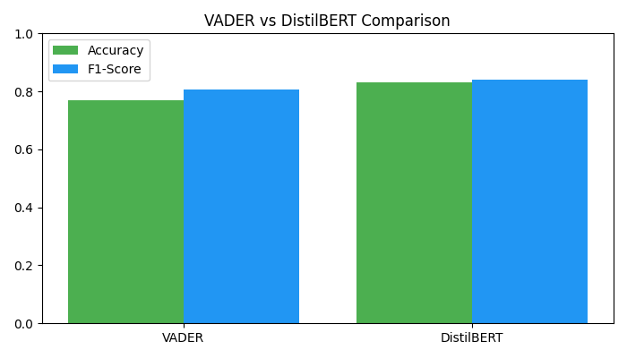
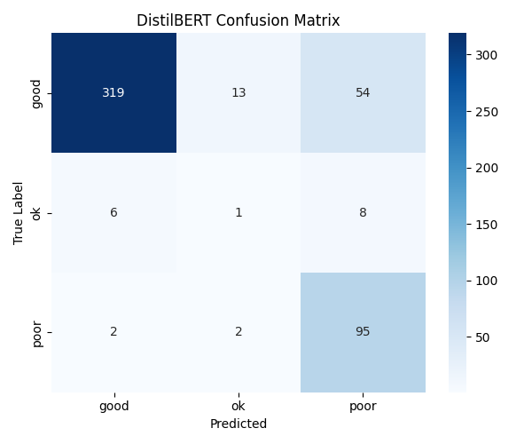

# Real-Time Distributed Brand Sentiment Monitor

> Kafka · Spark Streaming · VADER · DistilBERT · Hadoop HDFS · Streamlit

A distributed real-time sentiment analysis pipeline for brand monitoring built on a multi-node Hadoop cluster. The system streams product reviews through Kafka, classifies sentiment in real-time using VADER, detects brand-level sentiment drift, stores results in HDFS, and visualises everything on a live Streamlit dashboard. DistilBERT is used as an offline high-accuracy benchmark for research comparison.

---

## Results at a glance

| Model | Accuracy | Precision | Recall | F1-Score | Mode |
|---|---|---|---|---|---|
| VADER | 76.80% | 85.63% | 76.80% | 80.56% | Real-time streaming |
| DistilBERT | 83.00% | 87.48% | 83.00% | 83.97% | Offline evaluation |

---

## Architecture

```
Dataset (147,688 reviews)
        ↓
Kafka Producer  →  reviews_stream topic
        ↓
Spark Structured Streaming (micro-batch · 20s)
        ↓
VADER Sentiment Classification
        ↓
Sliding-Window Drift Detection (per brand · Δpoor > 15% = alert)
        ↓
HDFS Storage (Parquet) ─────────────────────────┐
        ↓                                        ↓
Streamlit Dashboard                   DistilBERT Offline Eval
```

---

## Hadoop cluster configuration

| Node | Role |
|---|---|
| master | NameNode · ResourceManager · Kafka · Spark driver · Streamlit |
| slave1 | DataNode · NodeManager · HDFS block storage |
| slave2 | DataNode · NodeManager · HDFS block storage |
| slave3 | DataNode · NodeManager · HDFS block storage |
| secondary | Secondary NameNode |

---

## Dataset

**Source:** E-commerce mobile phone reviews  
**Size:** 147,688 records  
**Columns:** Brand Name · Rating · Reviews · label (good / ok / poor)  
**Brand coverage:** Apple, Samsung, OnePlus, Xiaomi, and others

| Label | Count |
|---|---|
| good | 109,309 |
| poor | 29,834 |
| ok | 8,545 |

---

## Research novelty

This project is differentiated from existing Hadoop sentiment analysis systems by combining four features that no single prior work integrates together:

1. **Hybrid two-tier inference** — VADER handles low-latency streaming; DistilBERT provides a high-accuracy offline benchmark. This separates latency-sensitive and accuracy-sensitive workloads explicitly.
2. **Sliding-window drift detection** — tracks per-brand sentiment change batch-over-batch and fires alerts when negative sentiment rises more than 15%. Most sentiment systems only classify; this one monitors.
3. **Resource-constrained design** — the entire system runs on a VirtualBox multi-node cluster without GPU, demonstrating practical CPU-only distributed NLP at scale.
4. **End-to-end distributed pipeline** — Kafka ingestion → Spark processing → HDFS storage → live dashboard, with no single point of failure in the data path.

---

## Tech stack

| Component | Technology |
|---|---|
| Distributed storage | Hadoop HDFS |
| Resource management | Apache YARN |
| Message streaming | Apache Kafka |
| Stream processing | Apache Spark Structured Streaming |
| Real-time NLP | VADER SentimentIntensityAnalyzer |
| Offline NLP | DistilBERT (distilbert-base-uncased-finetuned-sst-2-english) |
| Dashboard | Streamlit |
| Language | Python 3.10 |
| Cluster environment | VirtualBox (Ubuntu) |

---

## Repository structure

```
brand-sentiment-monitor/
├── README.md
├── requirements.txt
├── prepare_data.py          # clean and normalise raw CSV
├── kafka_producer.py        # stream reviews to Kafka topic
├── spark_consumer.py        # Spark + VADER + drift detection + HDFS write
├── evaluate_distilbert.py   # offline DistilBERT evaluation + comparison charts
├── dashboard.py             # Streamlit real-time dashboard
└── assets/
    ├── architecture_flowchart.png
    ├── cluster_diagram.png
    ├── dashboard_screenshot.png
    ├── drift_alerts_terminal.png
    ├── confusion_matrix_distilbert.png
    └── model_comparison.png
```

---

## Setup and run

### Prerequisites

- Ubuntu (master + 3 slaves + secondary VM)
- Hadoop 3.x installed and configured
- Kafka 3.x installed
- Python 3.10
- 16 GB total RAM across cluster

### Install Python dependencies

```bash
pip install pandas kafka-python pyspark vaderSentiment \
            transformers torch scikit-learn streamlit \
            matplotlib seaborn
```

### Start services (in order)

```bash
# 1. Hadoop
start-dfs.sh && start-yarn.sh
jps   # confirm NameNode, DataNode, ResourceManager visible

# 2. Zookeeper
cd ~/kafka && bin/zookeeper-server-start.sh config/zookeeper.properties

# 3. Kafka broker
cd ~/kafka && bin/kafka-server-start.sh config/server.properties

# 4. Verify topic
cd ~/kafka && bin/kafka-topics.sh --list --bootstrap-server localhost:9092
# expected: reviews_stream
```

### Run the pipeline

```bash
# Terminal 1 — prepare data
python3 prepare_data.py

# Terminal 2 — Spark consumer (start first)
rm -rf /tmp/checkpoint_brand
python3 spark_consumer.py

# Terminal 3 — Kafka producer
python3 kafka_producer.py

# Terminal 4 — dashboard
streamlit run dashboard.py

# After streaming completes — offline evaluation
python3 evaluate_distilbert.py
```

---

## Screenshots

### Live dashboard


### Streaming drift detection (terminal)



### Evaluation metrics (VADER vs DistilBERT)



### DistilBERT confusion matrix



---

## Key findings

- VADER achieves 76.8% accuracy with near-zero latency per batch, making it viable for real-time streaming on CPU-only infrastructure.
- DistilBERT achieves 83.0% accuracy offline, confirming the accuracy-latency trade-off is justified.
- The system successfully detected Apple and Samsung sentiment drift events (Δpoor > 0.15) during streaming, demonstrating operational monitoring capability beyond simple classification.
- The Hadoop cluster remained stable across 20+ micro-batches with three live DataNodes and zero under-replicated blocks.

---

## Challenges and solutions

| Challenge | Solution |
|---|---|
| DistilBERT crashes VM in streaming | Moved to VADER for live inference; DistilBERT offline only |
| Spark–Pandas timestamp error on toPandas() | Drop process_time column before conversion |
| HDFS NameNode not running after crash | Restart with start-dfs.sh; local CSV fallback added |
| Kafka consumer heartbeat timeout | Increased maxOffsetsPerTrigger, added 2s sleep in producer |
| Small file problem in HDFS | Grouped batch writes into single Parquet append per batch |

---

## Authors

- Abhinav Nirapure — DSAI, IIIT Naya Raipur
- Shaurya Kumar — DSAI, IIIT Naya Raipur
- Yuvraj Bhatkariya — DSAI, IIIT Naya Raipur

Supervisor: Dr. Mallikharjuna Rao K, IIIT Naya Raipur

---

## Note on deployment

This is a distributed systems research project. There is no hosted demo — the system runs on a multi-node Hadoop cluster in VirtualBox. The repository contains all source code, configuration guidance, and output screenshots to reproduce the results. A short simulation video of the live dashboard is included in the repository.